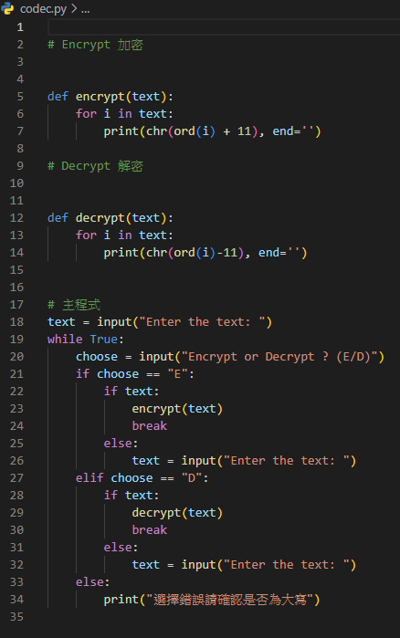

### Github repo url

[My github](https://github.com/anan826/encrypt-decrypt-easy-.git)

### 這個是我自己製作的簡易加密/解密器

### 以下是解碼器的 source code



### 會有這個念頭是平常用手機跟朋友聊天的時候突然想到，如果我要問對方事情

### 而這件事情是朋友不希望被在他旁邊的人知道，卻又可以使朋友能夠隱密的知道

### 訊息內容，所以當時就在想有什麼辦法可以隱藏文字訊息，進而做到更隱密的通訊。

### 最初的方法

### 當時是想到利用網頁的 16 進位轉 ASCII 的方法去做加密通訊，

### 但用著就覺得這個網路上都找的到，到不如自己做一個試試看。


https://www.rapidtables.org/zh-TW/convert/number/hex-to-ascii.html

# 過程

### 過程中遇到很多問題像是忘記將判斷式 elif 的解密的內容改成 decrypt 函數，

### 導致解密的功能還是加密(如下)

```
# Encrypt 加密
def encrypt(text, *args):
    for i in text:
        print(ord(i) + 11, end='')

# Decrypt 解密
def decrypt(text, *args):
    for i in text:
        print(chr(ord(i) - 11), end='')

# 主程式
choose = input("Encrypt or Decrypt ? (E/D)")
text = input("Enter the ciphertext: ")
if choose == "E":
    encrypt(text)
elif choose == "D":
    encrypt(text)
else:
    print("選擇錯誤請確認是否為大寫")

```

### 以及經過加密後的密文再經過解密後會是亂碼，經過確認後是資料型態的問題

## 經修正過後如下

```
# Encrypt 加密
def encrypt(text, *args):
    for i in text:
        print(chr(ord(i) + 11), end='')

# Decrypt 解密
def decrypt(text, *args):
    for i in text:
        print(chr(ord(i) - 11), end='')

# 主程式
choose = input("Encrypt or Decrypt ? (E/D)")
text = input("Enter the ciphertext: ")
if choose == "E":
    encrypt(text)
elif choose == "D":
    encrypt(text)
else:
    print("選擇錯誤請確認是否為大寫")
```

### 還有就是當第一次輸入後如果輸入的不是 E 或 D，依然會往下執行輸入文字後再報錯

### 後來經過試錯以及修改變成先輸入文字再執行加密或解密的選項並使用 while 迴圈直到輸入成功

### 如下圖

```
# Encrypt 加密
def encrypt(text, *args):
    for i in text:
        print(ord(i) + 11, end='')

# Decrypt 解密
def decrypt(text, *args):
    for i in text:
        print(chr(ord(i)-11), end='')

# 主程式
text = input("Enter the text: ")
while True:
    choose = input("Encrypt or Decrypt ? (E/D)")
    if choose == "E":
        if text:
            encrypt(text)
            break
        else:
            text = input("Enter the text: ")
    elif choose == "D":
        if text:
            decrypt(text)
            break
        else:
            text = input("Enter the ciphertext: ")
    else:
        print("選擇錯誤請確認是否為大寫")

```

# 結論

### 其實加/解密的方法很簡單，也就是使用俗稱的凱薩密碼做加密，但這個僅僅

### 用在日常普通的加密通訊對我來說已足夠了。

### 完成這些花了我些許時間， 雖然內容的難度不高，但我從中學習到的東西，

### 卻比只用單純的網頁轉換器學到的更多，與其當個使用工具的人，我更想成為

### 一個自己動手做工具的人。
